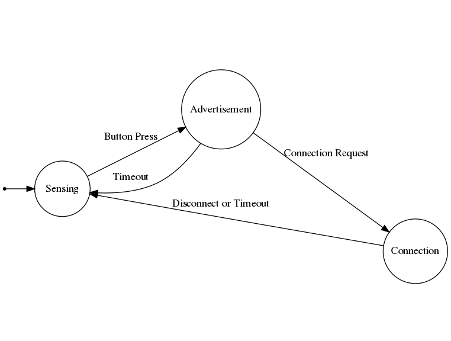
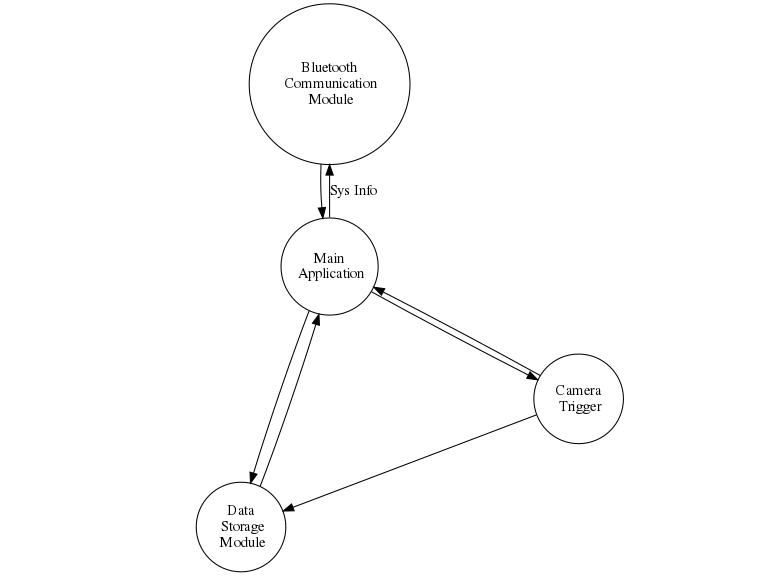

/**
@addtogroup sense_appln
@{

# SensePi Firmware

[SensePi](https://appiko.org/sensepi.html) is a motion based camera triggering device. This device can be used 
to trigger DSLRs and Point and Shoot cameras. This device can be used as a trigger 
for other systems as well. 

There is no active sensor being used in this device.

## Application Explanation :

SensePi Firmware is an application which handles multiple modules which serves
a different purpose like handling camera triggering, wireless connection, data
storage into non-volatile memory.

This application also handles events generated by some sub-modules like 
button press module, add tick module, irq msg handler, etc.

### Working Principle :

SensePi Firmware works on event-driven principle. That means core will wake-up
only when some interrupt or events happens. Other times it'll be in sleep mode. 
This will result in a drastic drop in power consumption. Also by making it 
event-driven its response latency is very low. There are almost no instructions 
to perform between event and handler operations. The response time of the device
is very low. Control diagram will explain how program's flow is.

Firmware's working can be explained as a state machine having 3 states. 
The application will be always in one these states. These states are:

 - Advertisement
 - Connected
 - Sensing

This state machine mechanism is handled by following sub-modules : 

#### 1 IRQ message module : 
The state machine mechanism is handled by application level events. These events are
Add Tick Event and State Change Event. These events are triggered by interrupts of 
different modules. To handle these events we have used the circular buffer. These 
events are treated as messages in the buffer. In interrupt handler of respective modules, 
these events are pushed into the circular buffer as a message. These messages then 
popped in the main thread and events will be handled.

#### 2 System tick module : 

This module generates Add Tick Event after a certain number of ms_timer_ticks has passed,
say 'n' ticks. This module uses ms_timer to generate an event. Every time the processor 
wakes up, this module checks how many ms_timer_ticks have passed since last event occurrence,
let's say it is 'tick count'. If that 'tick count' is greater than that of 'n/2' it generates
Add Tick event and starts counting ms_timer_ticks again. If 'tick count' is less than 'n/2' 
module will not do anything. If the processor doesn't wake up for 'n' ms_timer_ticks, this 
module will generate Add Tick event. The value of 'n' can be changed. This value will decide
maximum sleep time at any instance of time.  

#### 3 Button Press module :

Button press module works on button press duration. This sub-module will come into 
play when we press the button. From that instance, it'll calculate how long the button
has been pressed. Here we have divide button press durations in 3 different 'Durations':
Pressed, Short and Long.  As soon as the user presses the button, system ticks duration is 
changed to 100ms(in form of ms_timer_ticks here onwards).  At every Add Tick Event, it
adds 100ms to count and checks at which 'Duration' module is.  At 'short press duration',
the module will change SensePi's state to advertisement state. At 'long press duration' the
module forces SensePi into bootloader mode for a firmware update.

### States Machine : 
In each state, different sets of peripheral modules are active or serving different
requests. In SensePi we use BLE stack for Bluetooth connectivity.

#### 1 Advertisement : 

In this state, device's Bluetooth is on and ready to connect. To understand working 
of Advertisement state with respect to BLE stack read this [article](https://devzone.nordicsemi.com/b/blog/posts/bluetooth-smart-and-the-nordics-softdevices-part-1). 
In advertisement device will transmit specified data periodically. Then user can 
connect to device, possibly using 'Appiko setup' app or 'nrf Connect' app. 
Timeout for this state is 5 mins. 

#### 2 Connected : 

In this state, device is connected to a mobile device and hence cannot connect
with other mobile devices. To understand working of Connected state with respect 
to BLE protocol read this [article](https://devzone.nordicsemi.com/b/blog/posts/bluetooth-smart-and-the-nordics-softdevices-part-2). 
A user can send configurations from mobile to the device. Timeout for this state is 
10 mins.

#### 3 Sensing : 

This is the default state for the device. After Timeout or after disconnect SensePi 
will comeback in this state. This state handles PIR sensing & camera triggering.
There is no timeout for this state. 

By using this state machine approach we were able to avoid a lot of conflicting
scenarios 

### Control Flow Diagram :

The state diagram for SensePi is given below:

As one can see, the default state when SensePi starts it's operation is Sensing. 
If someone presses button present on SensePi, it'll go into Advertising state. 
There it'll wit for 3 mins for the Connection request. If it receives a connection request 
before 3 mins over, it'll connect with the requesting device. 

Once SensePi connects with some device, it can remain in this state for 10 mins. 
After 10 mins timeout will occur and it'll go back to Sensing state. If a user have 
proper mobile device and proper application to change the configuration, a user can 
do it in these 10 mins. And a user can also terminate the connection by sending disconnect 
request. 

### Data Flow Diagram :

This State machine implementation is done by building a firmware application in a 
modular structure. There are 3 supporting modules which handles different aspects 
of firmware. Those modules are :

 1. Bluetooth communication module
 1. Camera triggering module
 1. Data storage module

An interactions between these modules and application can be represented as follow :

In the context of this diagram communication means data transfer between any
two modules. Here all the arrows represents a transfer of sensepi_config until specified 
otherwise. Data transfer happens bidirectionally between modules, except for 
2 cases where it's unidirectional.
 
We can observe over there, all modules interact with the main application directly.
Almost all the inter-module communication is done through the main application. Only
once direct communication between two modules happens when Camera module saves
latest configuration in Flash memory through Data storage module. Passing of new
configuration from Bluetooth communication module to camera trigger module is also 
done through main application. 

On system power reset or firmware update, main application will load the latest 
configuration present in flash memory through Data storage module and will pass it 
on to Camera trigger module.

### Different Modules of application
#### 1 Bluetooth communication module

This module handles Bluetooth communication. i.e. this module decides what kind of
data is to be sent over Bluetooth. The structure which is to be used to send the 
data over Bluetooth is defined in this module. This module also handles how to 
serve different requests that it might get while using Bluetooth to communicate 
with other devices. One can refer to data structures over here.(link)

#### 2 Camera triggering module

This module handles the operation of a device when it's in sensing state. This module
handles the camera triggering related operations. This module uses the data sent by
a mobile device to the Bluetooth communication module and does the required configurations.
 These configurations contain mode of operation (i.e. timer, motion or both),
 light conditions (i.e day, night or both), type of trigger (different modes in 
which cameras can be triggered). 

#### 3 Data storage Module

This module handles the storage if data such as current config and firmware id in 
permanent memory. This data enables the device to restore the configuration data after 
OTA update is done or if the power supply gets disturbed. This module uses flash memory 
to store the data 

@}
*/
